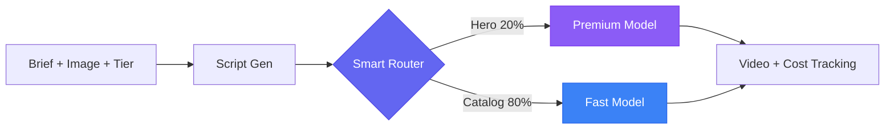

# AdCamp: AI Video Generation at Scale

[](https://www.byteplus.com/en/product/modelark)
[](https://opensource.org/licenses/MIT)
[](https://www.python.org/downloads/)
[]()

A production-ready pipeline for generating AI videos across thousands of products, listings, or items — with smart cost control built in. Fork it, configure it, deploy it.

---

## The Problem

A single product video costs **$500–5,000** to produce with a studio or agency. If you have 10,000 products, that's **$5M–50M** — impossible for most businesses.

AI video models (like [BytePlus Seedance](https://www.byteplus.com/en/product/modelark)) changed the economics: **$0.08–0.13 per video**. But going from "one API call" to "10,000 videos in production" requires solving real engineering problems:

- **Cost control** — Your best model costs 2x more than the fast one. Which products get which model?
- **Scale** — You can't generate 10K videos one at a time. You need batching with concurrency control.
- **Reliability** — APIs fail, rate limits hit, tasks timeout. Every failure needs automatic retry.
- **Tracking** — Finance needs to know what you're spending, per product, per tier, in real time.
- **Polling** — Video generation takes 30–60 seconds. You need async task management.

Building this from scratch: **4–8 weeks of engineering.** AdCamp gives you all of it, tested and ready to deploy.

## The Solution

AdCamp automatically routes each item to the right AI model based on its business value:

```
Your top 20% (hero products)  →  Premium model  →  Best quality   →  $0.13/video
The other 80% (catalog)        →  Fast model     →  Good enough    →  $0.08/video
                                                    Blended cost:     $0.09/video
```

At 10,000 items: **~$12K/year** in AI costs — replacing millions in manual production.



---

## Quick Start

```bash
git clone https://github.com/suboss87/adcamp.git && cd adcamp

make install                   # Create venv, install deps

cp .env.example .env           # Add your BytePlus ModelArk API key
# Edit .env → ARK_API_KEY=your_key_here

make dev                       # API on :8000, Dashboard on :8501
```

**Generate your first video:**
```bash
python3 docs/examples/generate_single_video.py
```

**Interactive API docs:** http://localhost:8000/docs

---

## Adapt for Your Industry

You change **4 files**. Everything else (pipeline, retry, batch, cost tracking, API, dashboard) works as-is.

| File | What You Change | Lines to Edit |
|------|----------------|---------------|
| `app/models/schemas.py` | Rename tiers (e.g. `luxury`/`standard` instead of `hero`/`catalog`) | ~3 |
| `app/config.py` | Your model IDs and token pricing | ~4 |
| `app/services/model_router.py` | Map your tiers to your models | ~3 |
| `app/services/video_gen.py` | Swap the API call if not using ModelArk | ~10 |

**Example — Real estate platform** with 50K listings:

```python
# schemas.py
class ListingTier(str, Enum):
    luxury = "luxury"      # $1M+ properties → cinematic video
    standard = "standard"  # rental listings → fast, cheap video

# model_router.py
_ROUTES = {
    ListingTier.luxury:   lambda: (settings.video_model_pro,  1.20),
    ListingTier.standard: lambda: (settings.video_model_fast, 0.70),
}
```

That's it. Luxury listings get premium video, standard listings get fast video, costs are tracked per listing, and the batch system handles 50K with concurrency control.

### Works for Any Industry

| Industry | Premium Tier | Standard Tier | Scale |
|----------|-------------|---------------|-------|
| **E-commerce** | Hero products (top 20% revenue) | Long-tail catalog | 1K–100K SKUs |
| **Real estate** | Luxury listings ($1M+) | Standard listings | 500–50K |
| **Automotive** | Featured/certified vehicles | Bulk inventory | 1K–500K |
| **Travel** | Premium destinations, suites | Standard rooms | 10K–1M |
| **Media** | Campaign hero spots | Social cutdowns | 100–10K |

---

## How It Works

<p align="center">
  
</p>

### 5-Step Pipeline

| Step | What Happens | Technology |
|------|-------------|------------|
| **1. Input** | Brief + product image + business tier | FastAPI request validation |
| **2. Script** | AI writes ad copy + video prompt | Seed 1.8 (OpenAI-compatible) |
| **2.5 Safety** | Screens scripts for 7 safety categories | Configurable thresholds |
| **3. Route** | Picks premium or fast model by tier | Pure function, ~37 lines |
| **4. Generate** | Async video creation + polling | ModelArk REST API + retry |
| **5. Output** | Platform-ready MP4 + cost breakdown | Cost tracker + monitoring |

### Five Reusable Patterns

Every pattern is in its own file, tested, and swappable:

| Pattern | File | What It Does | Lines |
|---------|------|-------------|-------|
| **Tiered Routing** | `app/services/model_router.py` | Routes items to models by business value | ~37 |
| **Async Pipeline** | `app/services/video_gen.py` | Submit → poll → result for long-running AI tasks | ~163 |
| **Cost Tracking** | `app/services/cost_tracker.py` | Per-request token counting and cost attribution | ~81 |
| **Batch Processing** | `app/services/batch_generator.py` | Semaphore-controlled concurrency + progress tracking | ~168 |
| **Retry Logic** | `app/utils/retry.py` | Exponential backoff, Retry-After, error classification | ~217 |

> These patterns transfer to **any AI workload** — image generation, text processing, audio synthesis. Replace the video API call and keep everything else.

### Model Economics (BytePlus ModelArk)

```
Premium  →  Seedance 1.5 Pro     ($1.20/M tokens)  →  ~$0.13/video
Standard →  Seedance 1.0 Pro Fast ($0.70/M tokens)  →  ~$0.08/video
Blended (20/80 split):                                  ~$0.09/video
```

| Scale | Products | Videos/Year | Annual Cost |
|-------|----------|-------------|-------------|
| Small | 500 | ~6,900 | ~$621 |
| Medium | 2,500 | ~34,500 | ~$3,105 |
| Large | 10,000 | ~138,000 | ~$12,420 |

### Cost Comparison: AdCamp vs Alternatives

| Approach | Cost per Video | 10K Videos | Open Source | Custom Tiers |
|----------|---------------|------------|-------------|--------------|
| **Studio/Agency** | $500–5,000 | $5M–50M | No | N/A |
| **Runway / Kling (manual)** | $0.50–2.00 | $5K–20K | No | No |
| **Creatify / Synthesia** | $0.10–1.00 | $1K–10K | No | No |
| **Raw API (no pipeline)** | $0.08–0.13 | ~$900 | DIY | DIY |
| **AdCamp** | **$0.08–0.13** | **~$900** | **Yes** | **Yes** |

> AdCamp gives you the same per-video cost as raw API calls, but with production infrastructure (batching, retry, cost tracking, monitoring) included and ready to deploy.

---

## Project Structure

```
adcamp/
│
├── app/                           ← YOUR CODE LIVES HERE
│   ├── main.py                    # API server + endpoints
│   ├── config.py                  # All settings (.env)
│   ├── models/schemas.py          # Request/response models (edit tiers here)
│   ├── services/
│   │   ├── model_router.py        # ⭐ Tier → model routing (edit this)
│   │   ├── video_gen.py           # ⭐ Video API calls (edit this)
│   │   ├── cost_tracker.py        # Cost tracking (works as-is)
│   │   ├── batch_generator.py     # Batch orchestration (works as-is)
│   │   ├── pipeline.py            # Orchestrates steps 1-5 (works as-is)
│   │   ├── script_writer.py       # AI script generation (works as-is)
│   │   ├── brief_generator.py     # Brief generation (works as-is)
│   │   ├── csv_parser.py          # CSV import (works as-is)
│   │   └── firestore_client.py    # Database layer (works as-is)
│   ├── routes/campaigns.py        # Campaign CRUD (works as-is)
│   └── utils/retry.py             # ⭐ Retry with backoff (works as-is)
│
├── dashboard/                     ← STREAMLIT UI (works as-is)
├── tests/                         ← 76 TESTS (all passing)
├── deploy/                        ← DEPLOYMENT CONFIGS
│   ├── byteplus/                  # BytePlus VKE (recommended)
│   ├── docker/                    # Docker Compose
│   ├── gcp/                       # Cloud Run + Terraform
│   ├── aws/                       # ECS Fargate
│   ├── kubernetes/                # Standard K8s manifests
│   └── monitoring/                # Prometheus + Grafana
└── docs/                          ← GUIDES + EXAMPLES
    ├── examples/                  # Runnable Python scripts
    └── architecture/              # Diagrams
```

**Key insight:** Files marked "edit this" are the 4 you customize. Everything marked "works as-is" is infrastructure you get for free.

---

## API Endpoints

| Endpoint | Method | Purpose |
|----------|--------|---------|
| `/api/generate` | POST | Full pipeline → returns task_id |
| `/api/generate-stream` | POST | Same, with SSE live progress |
| `/api/status/{task_id}` | GET | Poll video generation status |
| `/api/wait/{task_id}` | GET | Block until video ready |
| `/api/campaigns/` | POST | Create a campaign |
| `/api/campaigns/{id}/products` | POST | Upload product catalog (CSV) |
| `/api/campaigns/{id}/generate` | POST | Start batch generation |
| `/api/cost-summary` | GET | Aggregate cost tracking |
| `/health` | GET | Health + model config |
| `/metrics` | GET | Prometheus text format |

## Deployment

| Platform | Time | Best For | Guide |
|----------|------|----------|-------|
| **BytePlus VKE** | 30 min | Production (recommended) | [deploy/byteplus/](deploy/byteplus/) |
| **Docker Compose** | 5 min | Local dev | [deploy/docker/](deploy/docker/) |
| **GCP Cloud Run** | 20 min | GCP shops | [deploy/gcp/](deploy/gcp/) |
| **AWS ECS** | 30 min | AWS shops | [deploy/aws/](deploy/aws/) |
| **Kubernetes** | 45 min | Multi-cloud / on-prem | [deploy/kubernetes/](deploy/kubernetes/) |

> **Why BytePlus VKE first?** AdCamp calls ModelArk APIs for every video. Deploying on BytePlus VKE co-locates your compute with the AI inference endpoint — lowest latency, no cross-cloud egress, one vendor for compute + AI.

## Testing

```bash
make test                                    # All 76 tests with coverage
pytest tests/unit/test_model_router.py -v    # Routing logic
pytest tests/unit/test_cost_tracker.py -v    # Cost calculations
pytest tests/unit/test_retry.py -v           # Retry/resilience
pytest tests/unit/test_pipeline.py -v        # Pipeline orchestration
pytest tests/unit/test_csv_parser.py -v      # CSV validation
pytest tests/unit/test_security.py -v        # Auth, CORS, rate limits
```

## Production Security

Built in, activated via environment variables:

| Area | Default | Production Setting |
|------|---------|-------------------|
| **Auth** | Open | `API_KEY=your-secret` — Bearer token on `/api/*` routes |
| **CORS** | `*` | `CORS_ORIGINS=https://yourdomain.com` |
| **Rate limiting** | 60/min | `RATE_LIMIT=30/minute` |
| **Upload limits** | 10 MB | `MAX_UPLOAD_SIZE_MB=5` |

For persistence and observability, add Prometheus (config provided in `deploy/monitoring/`) and a database for cost tracking.

## Tech Stack

| Layer | Technology |
|-------|-----------|
| **AI Models** | [BytePlus ModelArk](https://www.byteplus.com/en/product/modelark) — Seed 1.8, Seedance Pro/Fast |
| **Backend** | FastAPI, async/await, SSE streaming |
| **Dashboard** | Streamlit |
| **Persistence** | Google Firestore |
| **Deployment** | BytePlus VKE, Docker, GCP Cloud Run, AWS ECS, Kubernetes, Terraform |

## Documentation

- **[Quick Start Options](docs/QUICKSTART.md)** — Railway, Render, Docker, VKE
- **[GCP Deployment](docs/DEPLOY.md)** — Cloud Run step-by-step
- **[Examples](docs/examples/)** — Single video + batch campaign scripts
- **[API Docs](http://localhost:8000/docs)** — Swagger UI (run locally)
- **[Contributing](.github/CONTRIBUTING.md)** — How to contribute

---

**Built by [Subash Natarajan](https://www.linkedin.com/in/subashn/)** | Powered by [BytePlus ModelArk](https://www.byteplus.com/en/product/modelark)
