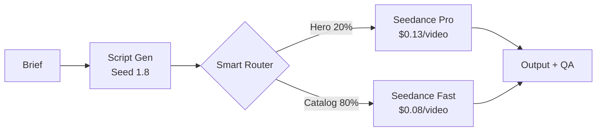

# SeedCamp

**Cost-optimized AI video generation at scale. Route smart, spend less, ship more.**

[](tests/) [](LICENSE) [](https://www.python.org/) [](#deploy-anywhere)

## The Problem

Every AI video tool works great for one video. Try generating 10,000 and you hit the wall: costs explode, quality is inconsistent, failures cascade, and there's no way to prioritize your best products over your long tail.

Companies with 500+ SKUs, vehicle listings, or property portfolios need production-grade orchestration — not a notebook with a for-loop. They need cost control, quality gates, retry logic, and smart routing that sends premium resources where they'll actually drive revenue.

That's the gap SeedCamp fills.

## The Solution

Route your top 20% to a premium model. Send the other 80% through a fast model. Save 40%+ on blended cost without sacrificing quality where it matters.



**The math:** At 10,000 items — 2,000 hero × $0.13 + 8,000 catalog × $0.08 = **~$900/year**. Blended cost: **$0.09/video**. Without routing, you'd pay $1,300 running everything on premium.

## Quick Start

```bash
git clone https://github.com/suboss87/seedcamp.git && cd seedcamp
make install

# Try without an API key (dry-run mode simulates the full pipeline)
DRY_RUN=true make dev    # API on :8000, dashboard on :8501
```

Set `ARK_API_KEY` in `.env` when you're ready for real generation. See [`.env.example`](.env.example) for all options.

**Generate your first video:**
```bash
python3 docs/examples/generate_single_video.py
```

**Try an industry example:**
```bash
python3 docs/examples/automotive_dealer.py
python3 docs/examples/ecommerce_catalog.py
python3 docs/examples/real_estate_listing.py
```

## 5 Patterns You Get

Every pattern is extracted, tested, and ready to reuse in your own AI pipeline.

| Pattern | What it does | File | Lines |
|---|---|---|---|
| **Tiered Model Routing** | Routes requests to optimal model by business value | `app/services/model_router.py` | ~37 |
| **Async Task Pipeline** | Fire-and-forget generation with polling and timeout | `app/services/video_gen.py` | ~163 |
| **Cost Tracking** | Per-request token counting and cost attribution | `app/services/cost_tracker.py` | ~81 |
| **Batch Orchestration** | Semaphore-controlled concurrency with error isolation | `app/services/batch_generator.py` | ~266 |
| **Retry with Backoff** | Exponential backoff, Retry-After honoring, error classification | `app/utils/retry.py` | ~210 |

These patterns transfer to **any AI workload** — image generation, LLM pipelines, audio synthesis. Swap the model call, keep the orchestration.

## Adapt for Your Industry

The tier system is a simple enum + route map. Change 3 lines:

```python
# Automotive: certified pre-owned → cinematic walkaround, bulk → quick showcase
class VehicleTier(str, Enum):
    featured = "featured"      # → Seedance Pro
    inventory = "inventory"    # → Seedance Fast
```

```python
# E-commerce: bestsellers → premium video, long-tail → cost-optimized
class ProductTier(str, Enum):
    hero = "hero"              # → Seedance Pro
    catalog = "catalog"        # → Seedance Fast
```

```python
# Real estate: luxury listings → cinematic, standard → quick walkthrough
class ListingTier(str, Enum):
    luxury = "luxury"          # → Seedance Pro
    standard = "standard"      # → Seedance Fast
```

| Industry | Hero tier | Catalog tier | Scale |
|---|---|---|---|
| **Automotive** | Certified, new arrivals | Wholesale, aged stock | 300–500K vehicles |
| **E-commerce** | Top 20% revenue SKUs | Long-tail catalog | 1K–100K SKUs |
| **Real Estate** | Luxury listings ($1M+) | Standard listings | 500–50K listings |
| **Media** | Campaign hero spots | Social cutdowns | 100–10K assets |

## Architecture

| Step | What happens | Technology |
|---|---|---|
| **1. Prompt** | Brief + image + tier | FastAPI + Streamlit dashboard |
| **2. Creative** | Script or 5-frame storyboard | Seed 1.8 + Seedream/Gemini (plugin) |
| **3. Route** | Picks model by business value | Pure function, ~37 lines |
| **4. Generate** | Async video + polling | Seedance Pro / Fast via ModelArk |
| **5. Validate** | Quality scoring + safety eval + human approval | 6 dimensions, configurable thresholds |

Image providers are plugins — Seedream and Gemini included, [add your own](app/services/image_providers/) by implementing one file.

## Deploy Anywhere

| Platform | Guide | Setup |
|---|---|---|
| **Local** | `make dev` | No Docker needed |
| **Docker** | [`deploy/docker/`](deploy/docker/) | `make docker-up` |
| **GCP Cloud Run** | [`deploy/gcp/`](deploy/gcp/) | Terraform |
| **AWS ECS Fargate** | [`deploy/aws/`](deploy/aws/) | Terraform |
| **BytePlus VKE** | [`deploy/byteplus/`](deploy/byteplus/) | K8s manifests |
| **Railway** | [`deploy/railway/`](deploy/railway/) | One-click |
| **Render** | [`deploy/render/`](deploy/render/) | One-click |

## Links

- **[Quick Start Guide](docs/QUICKSTART.md)** — Railway, Render, Docker in 30 min
- **[Deployment Guide](docs/DEPLOYMENT.md)** — All platforms, step by step
- **[API Docs](http://localhost:8000/docs)** — Swagger UI (run locally)
- **[Market Research](docs/market-research.md)** — Data behind the positioning
- **[Contributing](.github/CONTRIBUTING.md)** — Good first issues included
- **[Security](.github/SECURITY.md)** — Vulnerability reporting

---

Built by [Subash Natarajan](https://www.linkedin.com/in/subashn/) · Powered by [BytePlus ModelArk](https://www.byteplus.com/en/product/modelark)
