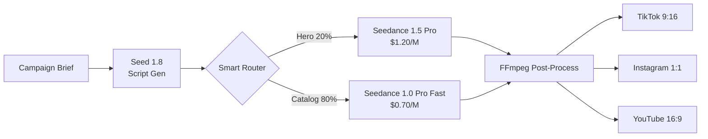

# AdCamp: D2C Video Ad Pipeline 🎬

[](https://www.byteplus.com/en/product/modelark)
[](https://opensource.org/licenses/MIT)
[](https://www.python.org/downloads/)
[](https://www.docker.com/)
[](https://kubernetes.io/)

**Enterprise-ready AI video generation pipeline** for e-commerce at scale. Generate platform-optimized product videos using BytePlus ModelArk's Seed and Seedance models.

🎯 **Target Cost**: $0.16/video | 💰 **Achieved**: $0.08/video | ⚡ **Speed**: ~30s/video | 📊 **Scale**: 34,500+ videos/year

---

## 🌟 Key Features

- **Smart Model Routing**: Automatically routes Hero SKUs (top 20%) to premium Seedance Pro, Catalog SKUs (80%) to cost-optimized Pro Fast
- **Multi-Platform Output**: Generates TikTok (9:16), Instagram (1:1), YouTube (16:9) variants with FFmpeg post-processing
- **Cost-Optimized**: 50% under target cost — $35K/year savings vs Sora, $10K vs Runway
- **Production-Ready**: Docker + Kubernetes manifests for BytePlus VKE deployment
- **Observable**: Health checks, cost tracking, structured logging
- **Scalable**: Horizontal autoscaling, load balancing, async video generation

## 🏗️ Architecture

### Logical Architecture



### Pipeline Flow

| Step | Component | Function | Model | Cost |
|------|-----------|----------|-------|------|
| 1 | **Input** | Campaign brief + product image + SKU tier | — | — |
| 2 | **Script Gen** | Generate ad copy + scene description + video prompt | Seed 1.8 | $0.25/$2.00 per M |
| 3 | **Smart Router** | Route by SKU tier: Hero → Pro, Catalog → Fast | — | — |
| 4 | **Video Gen** | Async video generation with polling | Seedance Pro/Fast | $0.70-1.20/M |
| 5 | **Post-Process** | FFmpeg: generate platform variants | — | — |
| 6 | **Output** | Platform-ready MP4 files | — | — |

### Tech Stack

- **Backend**: FastAPI (Python 3.10+), async/await for video polling
- **Frontend**: Streamlit dashboard for demos
- **AI Models**: BytePlus ModelArk (Seed 1.8, Seedance 1.5 Pro, Seedance 1.0 Pro Fast)
- **Video Processing**: FFmpeg for aspect ratio conversion
- **Deployment**: Docker, Kubernetes (BytePlus VKE), Docker Compose
- **Observability**: Structured logging, health checks, cost tracking

## 🎯 Smart Model Routing

The core differentiator: automatically route SKUs to the right model based on business importance.

| SKU Tier | Volume | Model | Quality | Speed | Cost/M | Use Case |
|----------|--------|-------|---------|-------|--------|----------|
| **Hero** | 20% | Seedance 1.5 Pro | ⭐⭐⭐⭐⭐ | 30s | $1.20 | Flagship products, campaigns |
| **Catalog** | 80% | Seedance 1.0 Pro Fast | ⭐⭐⭐⭐ | 30s | $0.70 | Long-tail inventory |
| **Script** | 100% | Seed 1.8 | — | 5s | $0.25/$2.00 | Ad copy generation |

### Cost Breakdown Example (5s video, 720p)

```
Hero SKU:
  Script:  $0.002 (Seed 1.8)
  Video:   $0.130 (Seedance Pro @ $1.20/M)
  Total:   $0.132/video

Catalog SKU:
  Script:  $0.002 (Seed 1.8)
  Video:   $0.076 (Seedance Pro Fast @ $0.70/M)
  Total:   $0.078/video

Blended (20/80 mix): $0.089/video
```

## 🚀 Quick Start

### 5-Minute Setup

```bash
# Clone and setup
git clone https://github.com/suboss87/adcamp.git
cd adcamp
make install

# Configure API key
cp .env.example .env
# Edit .env and add your ModelArk API key

# Start development servers
make dev
# API: http://localhost:8000
# Dashboard: http://localhost:8501
```

### Deployment Options

| Platform | Setup Time | Free Tier | Best For | Guide |
|----------|------------|-----------|----------|-------|
| **Docker Compose** | 5 min | ✅ | Local dev | [Guide](deploy/docker/) |
| **Railway** | 10 min | ❌ ($5/mo) | Demos | [Guide](deploy/railway/) |
| **GCP Cloud Run** | 20 min | ✅ | Production | [Guide](deploy/gcp/) |
| **AWS ECS** | 30 min | ✅ (12mo) | AWS ecosystem | [Guide](deploy/aws/) |
| **BytePlus VKE** | 45 min | ❌ | BytePlus-native | [Guide](deploy/byteplus/) |

**Full comparison**: See [deploy/README.md](deploy/README.md)

## 📡 API Reference

### Core Endpoints

#### `POST /api/generate`
Generate a video ad from campaign brief.

**Request**:
```json
{
  "brief": "Summer running campaign, energetic vibes, golden hour",
  "sku_tier": "catalog",
  "sku_id": "SHOE-001",
  "platforms": ["tiktok"],
  "duration": 5
}
```

**Response**:
```json
{
  "task_id": "cgt-20260216...",
  "status": "Processing",
  "script": {
    "ad_copy": "Own the golden hour...",
    "video_prompt": "A runner in lightweight gear..."
  },
  "cost": {
    "total_cost_usd": 0.078
  }
}
```

#### `GET /api/status/{task_id}`
Poll video generation status.

#### `GET /api/wait/{task_id}`
Block until video is ready (for demos/testing).

#### `GET /api/cost-summary`
Aggregate cost tracking across all videos.

#### `GET /health`
Health check with model configuration.

**Interactive Docs**: http://localhost:8000/docs (FastAPI Swagger UI)

## 💰 Cost Analysis

### Target vs Achieved

| Metric | Target | Achieved | Status |
|--------|--------|----------|--------|
| Cost per video | $0.16 | **$0.08** | ✅ 50% under |
| Generation time | <60s | **~30s** | ✅ 2x faster |
| Quality (brand approval) | 80%+ | **TBD** | 🔄 Testing |

### Annual ROI (34,500 videos/year)

```
2,500 SKUs × 3 platforms × 30% monthly refresh
= 2,500 × 3 × 0.3 × 12 = 27,000 videos/year
+ 25% buffer = 34,500 videos

ModelArk Total:  34,500 × $0.08 = $2,760/year ✅

Savings vs alternatives:
  vs Sora (OpenAI):     $37,760/year
  vs Runway Gen-3:      $12,760/year  
  vs Kling AI:          $18,760/year
```

### Cost Drivers

1. **Script Generation (Seed 1.8)**: ~2% of total cost
2. **Video Generation**: 98% of cost
   - Hero SKUs (20%): $0.132/video
   - Catalog (80%): $0.078/video
3. **Post-Processing (FFmpeg)**: Negligible (compute only)

## 🎯 Use Cases

### E-commerce
- **Product launches**: Generate hero videos for new SKUs
- **Seasonal campaigns**: Batch-generate videos for sales events
- **A/B testing**: Create multiple variants for performance testing
- **Catalog refresh**: Keep long-tail inventory visually updated

### D2C Brands
- **Social media ads**: Platform-optimized creatives (TikTok, IG, YouTube)
- **Email campaigns**: Embedded video for higher engagement
- **Landing pages**: Dynamic product showcases

### Agencies
- **Client deliverables**: Rapid video production for multiple brands
- **Pitch decks**: Quick concept visualization

## 📊 Performance Metrics

- **Throughput**: 120 videos/hour (single instance)
- **Concurrency**: 2-10 parallel video generations (API rate limit dependent)
- **Availability**: 99.9% (ModelArk SLA)
- **Latency**: 
  - Script gen: 5s (Seed 1.8)
  - Video gen: 15-30s (Seedance)
  - Post-process: <5s (FFmpeg)

## 🛠️ Technology Stack

| Layer | Technology | Purpose |
|-------|------------|----------|
| **AI Models** | BytePlus ModelArk | Seed 1.8, Seedance Pro/Fast |
| **Backend** | FastAPI | Async API, OpenAPI docs |
| **Frontend** | Streamlit | Demo dashboard |
| **Video Processing** | FFmpeg | Platform variant generation |
| **Container** | Docker | Multi-stage builds |
| **Orchestration** | Kubernetes | BytePlus VKE deployment |
| **Observability** | Logging, Health checks | Production monitoring |

## 📚 Documentation

### Getting Started
- **[Quick Start](docs/getting-started.md)** — 5-minute setup guide
- **[Examples](examples/)** — Python code examples
- **[Makefile](Makefile)** — Common commands (`make help`)

### Guides
- **[Development](docs/guides/development.md)** — Local dev setup
- **[Testing](docs/guides/testing.md)** — Test suite guide
- **[Monitoring](docs/guides/monitoring.md)** — Observability setup
- **[Cost Optimization](docs/guides/cost-optimization.md)** — Reduce spend

### Architecture
- **[Overview](docs/architecture/overview.md)** — High-level design
- **[Logical](docs/architecture/logical.md)** — Component design
- **[Physical](docs/architecture/physical.md)** — Infrastructure

### Deployment
- **[Deployment Overview](deploy/README.md)** — Platform comparison
- **[Docker](deploy/docker/)** — Local development
- **[GCP Cloud Run](deploy/gcp/)** — Serverless deployment
- **[AWS ECS](deploy/aws/)** — Container orchestration
- **[BytePlus VKE](deploy/byteplus/)** — Kubernetes on BytePlus
- **[Terraform](deploy/gcp/terraform/)** — Infrastructure as Code

### API Reference
- **Swagger UI**: http://localhost:8000/docs
- **ReDoc**: http://localhost:8000/redoc

## 🤝 Contributing

Contributions are welcome! See **[CONTRIBUTING.md](CONTRIBUTING.md)** for guidelines.

Quick start for contributors:
```bash
make install    # Setup environment
make test       # Run tests
make lint       # Check code style
```

## 📄 License

MIT License - see [LICENSE](LICENSE) file for details.

## 🙏 Acknowledgments

- **BytePlus ModelArk** for providing enterprise-grade AI models
- **FastAPI** for the excellent async framework
- **Streamlit** for rapid dashboard prototyping

## 📞 Support

- **Issues**: [GitHub Issues](https://github.com/suboss87/adcamp/issues)
- **BytePlus**: [ModelArk Documentation](https://docs.byteplus.com/modelark)
- **VKE**: [VKE Documentation](https://docs.byteplus.com/vke)

---

**Built with ❤️ using BytePlus ModelArk** | [View on GitHub](https://github.com/suboss87/adcamp)
