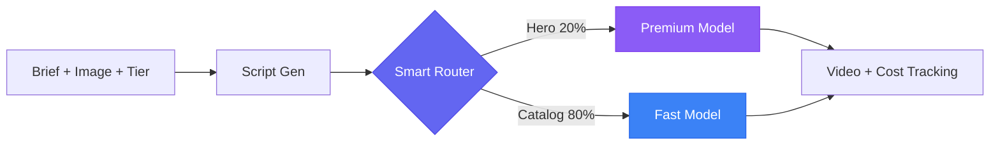

# AdCamp: Video Operations Infrastructure for Inventory-Scale Businesses

[](https://www.byteplus.com/en/product/modelark)
[](https://opensource.org/licenses/MIT)
[](https://www.python.org/downloads/)
[](https://github.com/suboss87/adcamp/actions)

An open-source reference architecture for cost-optimized AI video generation on [BytePlus ModelArk](https://www.byteplus.com/en/product/modelark). The core innovation: **smart 80/20 model routing** -- high-value items get the premium model, standard items get the fast model. Cuts video costs ~60% at scale.

**Not another video generator.** AdCamp is the operational layer between your inventory and AI video models -- batching, cost control, quality gates, retry logic, and monitoring that turns "one API call" into "10,000 videos in production."

---

## Why This Exists

### The $500-per-SKU Wall

Traditional video costs $500-$5,000 per video. AI dropped that to $0.08-$0.13. But every existing tool breaks at inventory scale:

| Tool | How It Breaks at Scale |
|------|----------------------|
| **Synthesia** | API gated behind opaque Enterprise tier. Content moderation inconsistent |
| **HeyGen** | "Unlimited" plan slashed to 120 min/mo overnight. Translation locked behind $5K/yr |
| **Runway** | Failed generations still consume credits. 16-sec max. Unpredictable costs |
| **Sora** | Removed free tier Jan 2026. Moderation blocks simple prompts |

The gap in the market isn't "another video generator" -- it's **video operations infrastructure** for businesses with 500+ items that each need video.

### The Market

The AI video generator market reached **$500M-$1.2B in 2025** (Fortune Business Insights, Grand View Research, IntelMarketResearch), growing at **18-20% CAGR**. Enterprise spending on AI video platforms grew **127% YoY** in 2025.

But most of that spend is on single-video tools. Nobody has built the production infrastructure layer for inventory-scale businesses -- until now.

### Validated Demand Across Verticals

| Vertical | Signal | Evidence |
|----------|--------|----------|
| **Automotive** | Phyron raised $11M proving this. Covideo launched AI at NADA 2026. Xcite Auto does $80M/yr. | 300+ vehicles/lot. 29.5% transaction increase (Renault Renew). Video shoppers 1.81x more likely to purchase. |
| **E-commerce** | Product video increases conversion 86% (Shopify). 80%+ SKUs have zero video coverage. | 1K-100K SKUs need video for TikTok Shop, Instagram, YouTube. |
| **Real estate** | Only 9% of agents make listing videos despite 403% more inquiries. | Listings with video sell up to 31% faster. Traditional walkthrough: $200-$500/listing. |

> See [docs/market-research.md](docs/market-research.md) for complete market validation with sources.

---

## The Solution

AdCamp automatically routes each item to the right AI model based on its business value:

```
Your top 20% (hero items)   -->  Premium model  -->  Best quality   -->  $0.13/video
The other 80% (standard)    -->  Fast model     -->  Good enough    -->  $0.08/video
                                                     Blended cost:      $0.09/video
```

At 10,000 items: **~$900/year** in AI costs -- replacing millions in manual production.



### What AdCamp Has That No Competitor Offers

| Capability | AdCamp | Synthesia / HeyGen / Runway |
|-----------|--------|-------------|
| Smart cost routing (Hero/Standard) | Yes | One model, one price |
| Budget enforcement mid-batch | Yes | Credits vanish with no guardrails |
| Quality evaluation before delivery | Yes | No built-in quality gates |
| Approve/reject/regenerate workflow | Yes | Platforms end at creation |
| Transparent, predictable pricing | Yes | Opaque enterprise tiers |
| Open source, self-hosted | Yes | SaaS with lock-in |
| GCS backup for URL permanence | Yes | CDN URLs expire silently |

### Cost Comparison

| Approach | Cost per Video | 10K Videos/Year | Open Source | Tiered Routing |
|----------|---------------|-----------------|-------------|----------------|
| **Studio/Agency** | $500-5,000 | $5M-50M | No | N/A |
| **Runway Gen-4 Turbo** | ~$0.50 | ~$5K | No | No |
| **Sora 2 (720p)** | ~$1.00 | ~$10K | No | No |
| **Google Veo 3 Fast** | ~$1.50 | ~$15K | No | No |
| **Raw ModelArk API** | $0.08-0.13 | ~$900 | DIY | DIY |
| **AdCamp** | **$0.08-0.13** | **~$900** | **Yes** | **Yes** |

> AdCamp gives you the same per-video cost as raw API calls, plus production infrastructure (batching, retry, cost tracking, quality gates, monitoring) ready to deploy.

---

## Quick Start (5 Minutes)

```bash
git clone https://github.com/suboss87/adcamp.git && cd adcamp

make install                   # Create venv, install deps

cp .env.example .env           # Add your BytePlus ModelArk API key
# Edit .env: ARK_API_KEY=your_key_here

make dev                       # API on :8000, Dashboard on :8501
```

### Try Without API Keys (Dry Run)

```bash
git clone https://github.com/suboss87/adcamp.git && cd adcamp
make install
DRY_RUN=true make dev          # Full pipeline with simulated responses
```

> Dry-run mode simulates all ModelArk API calls -- you get the complete pipeline experience (script generation, routing, cost tracking, quality evaluation, dashboard) without needing a BytePlus account.

**Generate your first video:**
```bash
# With the API running:
python3 docs/examples/generate_single_video.py
```

**Try an industry-specific example:**
```bash
python3 docs/examples/automotive_dealer.py      # Automotive dealership
python3 docs/examples/ecommerce_catalog.py      # E-commerce catalog
python3 docs/examples/real_estate_listing.py     # Real estate agency
```

**Interactive API docs:** http://localhost:8000/docs

---

## Adapt for Your Industry

You change **4 files**. Everything else (pipeline, retry, batch, cost tracking, API, dashboard) works as-is.

| File | What You Change | Lines to Edit |
|------|----------------|---------------|
| `app/models/schemas.py` | Rename tiers (e.g. `luxury`/`standard` instead of `hero`/`catalog`) | ~3 |
| `app/config.py` | Your model IDs and token pricing | ~4 |
| `app/services/model_router.py` | Map your tiers to your models | ~3 |
| `app/services/video_gen.py` | Swap the API call if not using ModelArk | ~10 |

### Industry Examples

**Automotive dealership** with 300+ vehicles per lot:

```python
# schemas.py -- rename tiers to match your inventory
class VehicleTier(str, Enum):
    featured = "featured"    # Certified/new models -> cinematic walkaround
    inventory = "inventory"  # Used/bulk stock -> quick showcase

# model_router.py -- map tiers to models
_ROUTES = {
    VehicleTier.featured:  lambda: (settings.video_model_pro,  1.20),
    VehicleTier.inventory: lambda: (settings.video_model_fast, 0.70),
}
```

**E-commerce catalog** with 10K+ SKUs:

```python
class ProductTier(str, Enum):
    hero = "hero"        # Top 20% revenue SKUs -> premium video
    catalog = "catalog"  # Long-tail -> cost-optimized

_ROUTES = {
    ProductTier.hero:    lambda: (settings.video_model_pro,  1.20),
    ProductTier.catalog: lambda: (settings.video_model_fast, 0.70),
}
```

**Real estate agency** with 500+ listings:

```python
class ListingTier(str, Enum):
    luxury = "luxury"      # $1M+ properties -> cinematic video
    standard = "standard"  # Rentals/standard -> quick walkthrough

_ROUTES = {
    ListingTier.luxury:   lambda: (settings.video_model_pro,  1.20),
    ListingTier.standard: lambda: (settings.video_model_fast, 0.70),
}
```

### Works for Any Inventory-Scale Business

| Industry | Premium Tier | Standard Tier | Typical Scale |
|----------|-------------|---------------|---------------|
| **Automotive** | Featured/certified vehicles | Bulk inventory | 300-500K vehicles |
| **E-commerce** | Hero products (top 20% revenue) | Long-tail catalog | 1K-100K SKUs |
| **Real estate** | Luxury listings ($1M+) | Standard listings | 500-50K listings |
| **Travel** | Premium destinations, suites | Standard rooms | 10K-1M rooms |
| **Media** | Campaign hero spots | Social cutdowns | 100-10K assets |

---

## How It Works

<p align="center">
  
</p>

### 5-Step Pipeline

| Step | What Happens | Technology |
|------|-------------|------------|
| **1. Input** | Brief + product image + business tier | FastAPI request validation |
| **2. Script** | AI writes ad copy + video prompt | Seed 1.8 (OpenAI-compatible) |
| **2.5 Safety** | Screens scripts for 7 safety categories | Configurable thresholds |
| **3. Route** | Picks premium or fast model by tier | Pure function, ~37 lines |
| **4. Generate** | Async video creation + polling | ModelArk REST API + retry |
| **5. Output** | Platform-ready MP4 + cost breakdown | Cost tracker + monitoring |

### Five Reusable Patterns

Every pattern is in its own file, tested, and swappable:

| Pattern | File | What It Does | Lines |
|---------|------|-------------|-------|
| **Tiered Routing** | `app/services/model_router.py` | Routes items to models by business value | ~37 |
| **Async Pipeline** | `app/services/video_gen.py` | Submit, poll, result for long-running AI tasks | ~163 |
| **Cost Tracking** | `app/services/cost_tracker.py` | Per-request token counting and cost attribution | ~81 |
| **Batch Processing** | `app/services/batch_generator.py` | Semaphore-controlled concurrency + progress tracking | ~168 |
| **Retry Logic** | `app/utils/retry.py` | Exponential backoff, Retry-After, error classification | ~217 |

> These patterns transfer to **any AI workload** -- image generation, text processing, audio synthesis. Replace the video API call and keep everything else.

### Model Economics (BytePlus ModelArk)

[Seedance 1.0](https://arxiv.org/html/2506.09113v1) ranks **#1 on Artificial Analysis** for both text-to-video and image-to-video generation (June 2025).

```
Premium  -->  Seedance 1.5 Pro     ($1.20/M tokens)  -->  ~$0.13/video
Standard -->  Seedance 1.0 Pro Fast ($0.70/M tokens)  -->  ~$0.08/video
Blended (20/80 split):                                     ~$0.09/video
```

| Scale | Products | Videos/Year | Annual Cost |
|-------|----------|-------------|-------------|
| Small | 500 | ~6,900 | ~$621 |
| Medium | 2,500 | ~34,500 | ~$3,105 |
| Large | 10,000 | ~138,000 | ~$12,420 |

### Why BytePlus ModelArk

- **Seedance ranks #1** on Artificial Analysis (mid-2025) for both I2V and T2V
- **Built-in cost tiers** -- Pro and Pro Fast models with 42% price difference
- **OpenAI-compatible API** -- standard integration, no vendor-specific SDK required
- **Growth-stage partner** -- BytePlus (ByteDance's enterprise arm) is actively building partnerships (Gaxos.ai deal, Feb 2026)
- **Co-location option** -- deploy on BytePlus VKE for lowest latency to ModelArk endpoints

---

## Project Structure

```
adcamp/
|
+-- app/                           <- YOUR CODE LIVES HERE
|   +-- main.py                    # API server + endpoints
|   +-- config.py                  # All settings (.env)
|   +-- models/schemas.py          # Request/response models (edit tiers here)
|   +-- services/
|   |   +-- model_router.py        # Tier-to-model routing (edit this)
|   |   +-- video_gen.py           # Video API calls (edit this)
|   |   +-- cost_tracker.py        # Cost tracking (works as-is)
|   |   +-- batch_generator.py     # Batch orchestration (works as-is)
|   |   +-- pipeline.py            # Orchestrates steps 1-5 (works as-is)
|   |   +-- script_writer.py       # AI script generation (works as-is)
|   |   +-- brief_generator.py     # Brief generation (works as-is)
|   |   +-- csv_parser.py          # CSV import (works as-is)
|   |   +-- safety_evaluator.py    # Content safety checks (works as-is)
|   |   +-- quality_evaluator.py   # Quality scoring (works as-is)
|   |   +-- notifications.py       # Webhook/Slack notifications (works as-is)
|   |   +-- asset_backup.py        # GCS backup (works as-is)
|   |   +-- dry_run.py             # Simulation mode (works as-is)
|   |   +-- firestore_client.py    # Database layer (works as-is)
|   |   +-- memory_store.py        # In-memory persistence (works as-is)
|   +-- routes/campaigns.py        # Campaign CRUD (works as-is)
|   +-- monitoring.py              # Prometheus metrics (works as-is)
|   +-- utils/retry.py             # Retry with backoff (works as-is)
|
+-- dashboard/                     <- STREAMLIT UI (works as-is)
+-- tests/                         <- 104 TESTS (all passing)
+-- deploy/                        <- DEPLOYMENT CONFIGS
|   +-- byteplus/                  # BytePlus VKE (recommended)
|   +-- docker/                    # Docker Compose
|   +-- gcp/                       # Cloud Run + Terraform
|   +-- aws/                       # ECS Fargate
|   +-- kubernetes/                # Standard K8s manifests
|   +-- monitoring/                # Prometheus + Grafana
+-- docs/                          <- GUIDES + EXAMPLES
    +-- examples/                  # Runnable Python scripts (4 industry examples)
    +-- architecture/              # Diagrams
    +-- market-research.md         # Market validation data
```

**Key insight:** Files you customize are `schemas.py`, `config.py`, `model_router.py`, and `video_gen.py`. Everything else is infrastructure you get for free.

---

## API Endpoints

| Endpoint | Method | Purpose |
|----------|--------|---------|
| `/api/generate` | POST | Full pipeline, returns task_id |
| `/api/generate-stream` | POST | Same, with SSE live progress |
| `/api/status/{task_id}` | GET | Poll video generation status |
| `/api/wait/{task_id}` | GET | Block until video ready |
| `/api/campaigns/` | POST | Create a campaign |
| `/api/campaigns/{id}/products` | POST | Upload product catalog (CSV) |
| `/api/campaigns/{id}/generate` | POST | Start batch generation |
| `/api/cost-summary` | GET | Aggregate cost tracking |
| `/health` | GET | Health + model config |
| `/metrics` | GET | Prometheus text format |

## Deployment

| Platform | Time | Best For | Guide |
|----------|------|----------|-------|
| **BytePlus VKE** | 30 min | Production (recommended) | [deploy/byteplus/](deploy/byteplus/) |
| **Docker Compose** | 5 min | Local dev | [deploy/docker/](deploy/docker/) |
| **GCP Cloud Run** | 20 min | GCP shops | [deploy/gcp/](deploy/gcp/) |
| **AWS ECS** | 30 min | AWS shops | [deploy/aws/](deploy/aws/) |
| **Kubernetes** | 45 min | Multi-cloud / on-prem | [deploy/kubernetes/](deploy/kubernetes/) |

> **Why BytePlus VKE first?** AdCamp calls ModelArk APIs for every video. Deploying on BytePlus VKE co-locates your compute with the AI inference endpoint -- lowest latency, no cross-cloud egress, one vendor for compute + AI.

> **Comprehensive guide:** See [docs/DEPLOYMENT.md](docs/DEPLOYMENT.md) for step-by-step instructions, environment variables, and production checklists for all platforms.

## Testing

```bash
make test                                      # All 104 tests with coverage
pytest tests/unit/test_model_router.py -v      # Routing logic
pytest tests/unit/test_cost_tracker.py -v      # Cost calculations
pytest tests/unit/test_retry.py -v             # Retry/resilience
pytest tests/unit/test_pipeline.py -v          # Pipeline orchestration
pytest tests/unit/test_csv_parser.py -v        # CSV validation
pytest tests/unit/test_security.py -v          # Auth, CORS, rate limits, upload validation
pytest tests/unit/test_safety_evaluator.py -v  # Content safety
pytest tests/unit/test_quality_evaluator.py -v # Quality scoring
```

## Production Security

Built in, activated via environment variables:

| Area | Default | Production Setting |
|------|---------|-------------------|
| **Auth** | Open | `API_KEY=your-secret` -- Bearer token on `/api/*` routes |
| **CORS** | `*` | `CORS_ORIGINS=https://yourdomain.com` |
| **Rate limiting** | 60/min | `RATE_LIMIT=30/minute` |
| **Upload limits** | 10 MB | `MAX_UPLOAD_SIZE_MB=5` |

For persistence and observability, add Prometheus (config provided in `deploy/monitoring/`) and a database for cost tracking.

## Tech Stack

| Layer | Technology |
|-------|-----------|
| **AI Models** | [BytePlus ModelArk](https://www.byteplus.com/en/product/modelark) -- Seed 1.8, Seedance Pro/Fast |
| **Backend** | FastAPI, async/await, SSE streaming |
| **Dashboard** | Streamlit |
| **Persistence** | In-memory (default) or Google Firestore |
| **Deployment** | BytePlus VKE, Docker, GCP Cloud Run, AWS ECS, Kubernetes, Terraform |

## Documentation

- **[Quick Start Options](docs/QUICKSTART.md)** -- Railway, Render, Docker, VKE
- **[Deployment Guide](docs/DEPLOYMENT.md)** -- Comprehensive guide for all platforms
- **[GCP Deployment](docs/DEPLOY.md)** -- Cloud Run step-by-step
- **[Examples](docs/examples/)** -- Single video, batch campaign, and cross-industry scripts
- **[Market Research](docs/market-research.md)** -- Data backing the market positioning
- **[API Docs](http://localhost:8000/docs)** -- Swagger UI (run locally)
- **[Contributing](.github/CONTRIBUTING.md)** -- How to contribute
- **[Code of Conduct](CODE_OF_CONDUCT.md)** -- Community standards

---

## Contributing

We welcome contributions! See [CONTRIBUTING.md](.github/CONTRIBUTING.md) for guidelines.

**Good first issues:**
- Add a new industry example (e.g., education, hospitality)
- Improve dashboard visualizations
- Add integration tests for the batch pipeline
- Write deployment guides for new platforms (Azure, DigitalOcean)
- Add multi-language brief support for non-English markets

---

**Built by [Subash Natarajan](https://www.linkedin.com/in/subashn/)** | Powered by [BytePlus ModelArk](https://www.byteplus.com/en/product/modelark)
