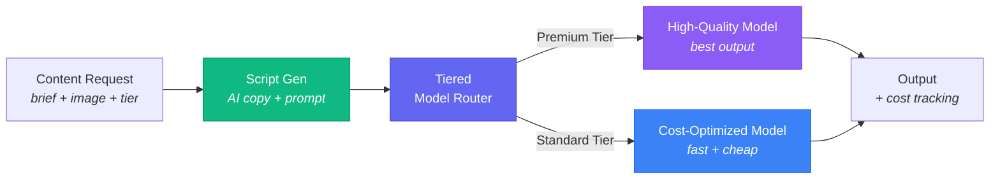

# AdCamp: Reference Architecture for Cost-Optimized AI Video Generation

[](https://www.byteplus.com/en/product/modelark)
[](https://opensource.org/licenses/MIT)
[](https://www.python.org/downloads/)
[]()

> **Built by [Subash Natarajan](https://www.linkedin.com/in/subashn/)** — The implementation blueprint for cost-optimized AI video generation at scale on [BytePlus ModelArk](https://www.byteplus.com/en/product/modelark).

---

## Why This Was Built

**The problem:** You have thousands of items (products, listings, vehicles) and you want AI-generated video for all of them. But your best AI model costs 2x more than the fast one. Running everything through the premium model is wasteful. Running everything through the cheap model undersells your top items.

**What you actually need:** A system that automatically looks at each item's business value and routes it to the right model — premium quality for the top 20% that drive revenue, fast and cheap for the other 80%.

**That's what AdCamp is.** It's a working pipeline that does this routing automatically, with cost tracking, batch processing, and failure handling built in. Fork it, change 4 files for your industry, and deploy.

**The result:** ~$0.09/video blended cost (vs $0.13 all-premium). At 10,000 items, that's ~$12K/year in AI costs — replacing what would cost millions in manual video production.

> **Implementation:** AdCamp uses [BytePlus ModelArk](https://www.byteplus.com/en/product/modelark) — **Seedance Pro** for premium-tier video and **Pro Fast** at 72% lower cost with 3x speed. The five architecture patterns work with any AI provider.

## Who Should Fork This

| You are... | You need... | AdCamp gives you... |
|------------|-------------|---------------------|
| **Any team** scaling AI video (e-commerce, real estate, automotive, media) | Cost control across thousands of items | Tiered routing + batch processing, ready to adapt |
| **AI/backend engineer** integrating ModelArk or any video AI API | Retry, polling, cost tracking patterns | 5 production-grade patterns to drop into your pipeline |
| **Solutions architect** evaluating AI video generation at scale | Proof that tiered routing works with real numbers | Working demo with cost breakdowns per tier |

## Architecture



> **Abstract pattern** — the implementation below uses video generation, but replace any box with your AI workload.

### Five Reusable Patterns

This reference architecture demonstrates five production-grade patterns that transfer to any AI generation pipeline:

#### 1. Tiered Model Routing
Route workloads to different models based on business value — premium quality for high-value items, cost-optimized for the long tail.

```python
# app/services/model_router.py — 28 lines, pure function
_ROUTES = {
    SKUTier.hero:    lambda: (settings.video_model_pro,  settings.cost_per_m_seedance_pro),
    SKUTier.catalog: lambda: (settings.video_model_fast, settings.cost_per_m_seedance_fast),
}
```

**Swap point**: Replace `SKUTier` with your own tier logic (customer segment, content priority, SLA level). Replace model IDs with any ModelArk model.

#### 2. Async Task Pipeline
Submit long-running AI jobs, poll for completion, handle success/failure/timeout — the universal pattern for any AI API that doesn't return results immediately.

```
POST /generate → task_id → GET /status/{task_id} → poll → result
```

**Swap point**: Replace `video_gen.create_video_task()` with any async AI API call.

#### 3. Token-Aware Cost Tracking
Track costs per request in real-time — tokens consumed, model used, cost per tier. Essential for any metered AI API (ModelArk, OpenAI, Anthropic, Stability).

```python
# Every pipeline run returns: {cost: CostBreakdown, model_id, in_tokens, out_tokens}
```

**Swap point**: Plug in your own token pricing from any AI provider.

#### 4. Batch Orchestration
Process thousands of items concurrently with semaphore-controlled parallelism, progress tracking, and partial failure handling.

```python
# app/services/batch_generator.py — asyncio.Semaphore(concurrency)
```

**Swap point**: Replace the video generation call with any AI workload.

#### 5. Resilient API Integration
Exponential backoff with rate-limit honoring (`Retry-After` header), error classification (retryable vs fatal), and circuit-breaking for non-recoverable errors.

```python
@retry_with_backoff(max_retries=3, initial_delay=2.0)
async def create_video_task(...):
```

**Swap point**: Wrap any external API call with `@retry_with_backoff`.

---

## Cross-Industry Applications

The tiered routing pattern applies wherever you have inventory with varying business value:

| Industry | Premium Tier (best model) | Standard Tier (fast model) | Scale |
|---|---|---|---|
| **E-commerce** | Hero products (top 20% revenue) | Catalog inventory (long tail) | 1K-100K SKUs |
| **Real estate** | Luxury listings ($1M+ properties) | Standard rental/sale listings | 500-50K listings |
| **Automotive** | Featured/certified vehicles | Bulk dealer inventory | 1K-500K vehicles |
| **Travel & hospitality** | Premium destinations, suites | Standard hotel rooms | 10K-1M listings |
| **Education** | Flagship courses, programs | Course previews, teasers | 100-10K courses |
| **Media & entertainment** | Campaign hero spots | Social media variants, cutdowns | 100-10K assets |
| **Food & beverage** | Signature/seasonal menu items | Standard menu catalog | 50-5K items |
| **Fashion & apparel** | Runway/editorial pieces | Product catalog shots | 1K-100K SKUs |
| **B2B SaaS** | Enterprise client demos | Feature walkthroughs | 50-500 demos |

**The pattern is the same**: identify your high-value items, route them to your best model, and route everything else to a faster, cheaper alternative.

---

## Implementation: Video Generation on ModelArk

This reference architecture is implemented as a complete video generation pipeline using BytePlus ModelArk's Seed and Seedance models.

### Pipeline Flow

| Step | Component | What It Does | Model | Cost (5s, 720p) |
|------|-----------|-------------|-------|------|
| 1 | **Input** | Campaign brief + product image + tier | — | — |
| 2 | **Script Gen** | AI generates ad copy + video prompt | Seed 1.8 | ~$0.001 |
| 3 | **Smart Router** | Routes premium vs standard tier | — | — |
| 4 | **Video Gen** | Async video generation with polling | Seedance Pro/Fast | $0.08-0.13 |
| 5 | **Output** | Platform-ready MP4 (TikTok, IG, YouTube) | — | — |

### Model Economics

```
Premium Tier  ──▶  Seedance 1.5 Pro     ($1.20/M tokens) ──▶  ~$0.13/video
Standard Tier ──▶  Seedance 1.0 Pro Fast ($0.70/M tokens) ──▶  ~$0.08/video

Blended (20/80 split): ~$0.09/video
```

> Token estimation: `(Width x Height x FPS x Duration) / 1024` — see `app/services/pipeline.py`. Actual BytePlus billing may differ; check [BytePlus pricing docs](https://docs.byteplus.com/en/docs/ModelArk/1544106) for current rates.

> **Seedance 2.0 Note**: BytePlus is rolling out Seedance 2.0 with per-second billing (replacing per-token for video). This architecture adapts easily — update model IDs and cost constants in `app/config.py`. The routing, pipeline, and cost-tracking patterns remain unchanged.

### Cost at Scale

| Scale | Items | Videos/Year | Annual Cost | vs Manual Production |
|-------|-------|-------------|-------------|---------------------|
| Small | 500 | ~6,900 | ~$621 | 99.9% savings |
| Medium | 2,500 | ~34,500 | ~$3,105 | 99.8% savings |
| Large | 10,000 | ~138,000 | ~$12,420 | 99.8% savings |

*3 platforms x 30% monthly refresh x 12 months + 25% buffer. Enterprise pricing from BytePlus can reduce costs further.*

---

## Quick Start

```bash
# Clone
git clone https://github.com/suboss87/adcamp.git
cd adcamp

# Install
make install

# Configure — add your BytePlus ModelArk API key
cp .env.example .env
# Edit .env: ARK_API_KEY=your_key_here

# Run (API on :8000, Dashboard on :8501)
make dev
```

**Generate your first video:**
```bash
python3 docs/examples/generate_single_video.py
```

**Interactive API docs:** http://localhost:8000/docs

## Tech Stack

| Layer | Technology | Purpose |
|-------|-----------|---------|
| **AI Models** | [BytePlus ModelArk](https://www.byteplus.com/en/product/modelark) | Seed 1.8 (scripts), Seedance Pro/Fast (video) |
| **Backend** | FastAPI + async/await | API server, SSE streaming, async polling |
| **Dashboard** | Streamlit | Campaign management, A/B comparison, analytics |
| **Persistence** | Google Firestore | Campaign and product data |
| **Resilience** | Custom `@retry_with_backoff` | Exponential backoff, rate-limit honoring |
| **Deployment** | Docker, GCP Cloud Run, Terraform | Multi-platform with IaC |
| **Monitoring** | Prometheus-compatible `/metrics` (in-memory) | Cost tracking, request counts, health checks |

### Dashboard

The Streamlit dashboard provides campaign management, A/B model comparison, and real-time cost analytics. Run it locally with `make dev` (port 8501).

## API Endpoints

| Endpoint | Method | Purpose |
|---|---|---|
| `/api/generate` | POST | Full pipeline — returns task_id for polling |
| `/api/generate-stream` | POST | Full pipeline with SSE live progress |
| `/api/status/{task_id}` | GET | Poll generation status |
| `/api/wait/{task_id}` | GET | Block until ready |
| `/api/campaigns/` | POST | Create a campaign |
| `/api/campaigns/{id}/products` | POST | Upload product catalog (CSV) |
| `/api/campaigns/{id}/generate` | POST | Start batch generation |
| `/api/cost-summary` | GET | Aggregate cost tracking |
| `/health` | GET | Health + model config |
| `/metrics` | GET | Prometheus text format |

## Deployment

| Platform | Setup | Best For | Guide |
|----------|-------|----------|-------|
| **Docker Compose** | 5 min | Local development | [deploy/docker/](deploy/docker/) |
| **GCP Cloud Run** | 20 min | Production (serverless) | [deploy/gcp/](deploy/gcp/) |
| **Terraform (GCP)** | 30 min | Infrastructure as Code | [deploy/gcp/terraform/](deploy/gcp/terraform/) |
| **AWS ECS** | 30 min | AWS ecosystem | [deploy/aws/](deploy/aws/) |
| **Kubernetes** | 45 min | Full control | [deploy/byteplus/](deploy/byteplus/) |

## Project Structure

```
adcamp/
├── app/
│   ├── main.py                 # FastAPI orchestrator
│   ├── config.py               # Pydantic Settings (.env)
│   ├── models/                 # Pydantic schemas
│   ├── services/
│   │   ├── model_router.py     # ⭐ Tiered routing logic (Pattern 1)
│   │   ├── video_gen.py        # ⭐ Async task + polling (Pattern 2)
│   │   ├── cost_tracker.py     # ⭐ Token-aware costing (Pattern 3)
│   │   ├── batch_generator.py  # ⭐ Semaphore concurrency (Pattern 4)
│   │   ├── pipeline.py         # Orchestrates patterns 1-3
│   │   ├── script_writer.py    # Seed 1.8 integration (OpenAI-compatible)
│   │   ├── brief_generator.py  # AI brief generation per product
│   │   ├── csv_parser.py       # Product catalog CSV import
│   │   └── firestore_client.py # Firestore persistence
│   ├── routes/
│   │   └── campaigns.py        # Campaign CRUD + batch endpoints
│   └── utils/
│       └── retry.py            # ⭐ @retry_with_backoff (Pattern 5)
├── dashboard/                  # Streamlit UI (tabs, A/B comparison)
├── deploy/                     # Docker, GCP, AWS, K8s, monitoring
├── docs/                       # Guides, changelog, examples
├── tests/                      # Unit tests (59 passing)
└── .github/                    # CONTRIBUTING, SECURITY, workflows
```

## Adapting for Your Use Case

You change **4 files** — everything else (pipeline, retry, batch, cost tracking, API, dashboard) works as-is.

| Step | File | What You Change |
|------|------|----------------|
| 1 | `app/models/schemas.py` | Rename tiers to your domain (e.g. `luxury` / `standard`) |
| 2 | `app/config.py` | Set your model IDs and token pricing |
| 3 | `app/services/model_router.py` | Map your tiers → your models (already 3 lines) |
| 4 | `app/services/video_gen.py` | Swap API call if not using ModelArk (keep same signature) |

**Example — Real estate platform** with 50K listings:

```python
# schemas.py — rename tiers
class SKUTier(str, Enum):
    luxury = "luxury"      # $1M+ properties → cinematic video
    standard = "standard"  # rental listings → fast, cheap video

# config.py — your pricing (or keep defaults for ModelArk)
cost_per_m_seedance_pro: float = 1.20   # luxury tier rate
cost_per_m_seedance_fast: float = 0.70  # standard tier rate
```

That's it. The pipeline routes luxury listings to the premium model, standard listings to the fast model, tracks costs per listing, and batches 50K listings with concurrency control — all without touching the infrastructure code.

## Testing

```bash
make test                                    # All 59 tests with coverage
pytest tests/unit/test_model_router.py -v    # Router tests (Pattern 1)
pytest tests/unit/test_cost_tracker.py -v    # Cost tracking tests (Pattern 3)
pytest tests/unit/test_retry.py -v           # Retry/resilience tests (Pattern 5)
pytest tests/unit/test_pipeline.py -v        # Pipeline integration tests (Patterns 1-3)
pytest tests/unit/test_csv_parser.py -v      # CSV parser tests
pytest tests/unit/test_security.py -v        # Security tests (auth, CORS, limits)
```

## Production Considerations

Security essentials are **built in** and activated via environment variables:

| Area | Default (Demo) | Production (Set in `.env`) |
|------|----------------|---------------------------|
| **Authentication** | Open endpoints | `API_KEY=your-secret` — Bearer token on all `/api/*` routes |
| **CORS** | `*` (any origin) | `CORS_ORIGINS=https://yourdomain.com` — comma-separated |
| **Rate limiting** | 60 req/min per client | `RATE_LIMIT=30/minute` — slowapi format |
| **Upload limits** | 10 MB max | `MAX_UPLOAD_SIZE_MB=5` — rejects oversized files with 413 |

Additional hardening for production deployments:

| Area | Current (Reference) | Production Recommendation |
|------|-------------------|--------------------------|
| **Metrics** | In-memory, resets on restart | Prometheus with persistent storage |
| **Cost tracking** | In-memory list | PostgreSQL or Redis for durable records |
| **Secrets** | `.env` file | Cloud secret manager (GCP/AWS SSM) |
| **Error reporting** | Logging only | Sentry or equivalent |

The five architecture patterns are production-grade in design. Security controls are built in. Persistence and observability need hardening for your specific deployment.

## Documentation

- **[DEPLOY.md](docs/DEPLOY.md)** — GCP Cloud Run deployment guide
- **[AGENTS.md](AGENTS.md)** — Full architecture reference for AI coding agents
- **[CONTRIBUTING.md](.github/CONTRIBUTING.md)** — Contribution guidelines
- **[examples/](docs/examples/)** — Runnable Python scripts
- **API Docs** — http://localhost:8000/docs (Swagger) / http://localhost:8000/redoc
- **Community** — [awesome-seedance](https://github.com/ZeroLu/awesome-seedance) (prompts, tutorials, and resources for Seedance models)

## Contributing

Contributions welcome! See [CONTRIBUTING.md](.github/CONTRIBUTING.md).

```bash
make install    # Setup environment
make test       # Run tests (59 passing)
make lint       # Check code style
```

## License

MIT License — see [LICENSE](LICENSE).

---

**Built by [Subash Natarajan](https://www.linkedin.com/in/subashn/)** | Powered by [BytePlus ModelArk](https://www.byteplus.com/en/product/modelark) | [View Source](https://github.com/suboss87/adcamp)
